<!-- Faceplates in assets/ are generated by tools/build.py from apexaiofficial.com content. Edit them there. -->

<a href="https://apexaiofficial.com"><picture><source media="(max-width: 640px)" srcset="assets/hero-narrow.svg"></picture></a>

  
  
  

ApexAi builds guarded web-data and business communications products with operator, API, and agent interfaces. **Scrapy** turns web sources into owned artifacts and versioned datasets. **Communications** runs business conversations on your own Twilio, SendGrid, and Telegram accounts, with consent and history built in.

Each product owns its rules. A person working in Telegram, an application calling ApexAPI, and an AI agent using ApexMCP all pass the same product policy before anything runs, and all get evidence back.

<a href="https://apexaiofficial.com/scrapy"><picture><source media="(max-width: 640px)" srcset="assets/scrapy-narrow.svg">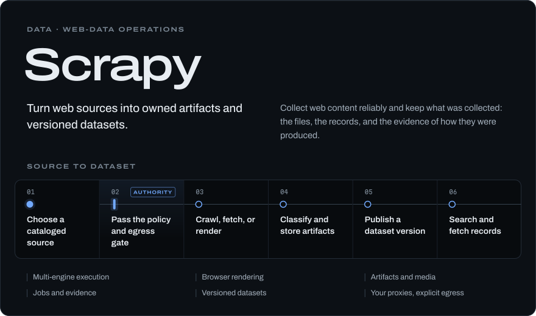</picture></a>

<a href="https://apexaiofficial.com/communications"><picture><source media="(max-width: 640px)" srcset="assets/communications-narrow.svg">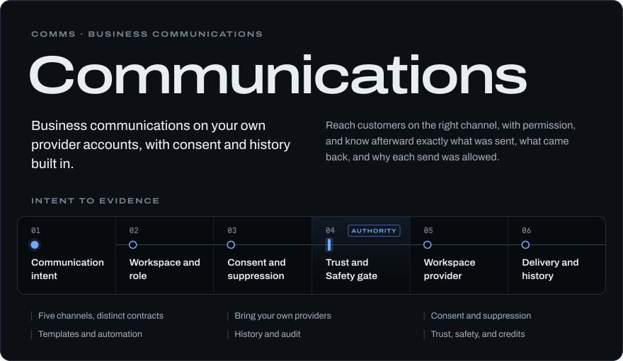</picture></a>

<a href="https://apexaiofficial.com/developers#availability"><picture><source media="(max-width: 640px)" srcset="assets/availability-narrow.svg">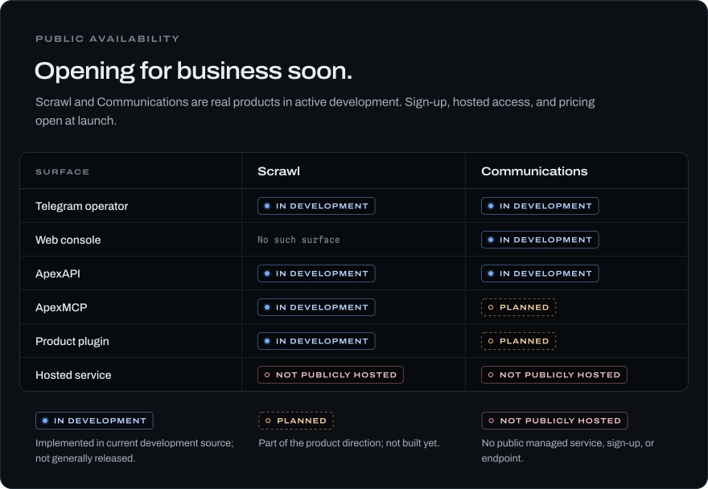</picture></a>

<a href="https://apexaiofficial.com/developers"><picture><source media="(max-width: 640px)" srcset="assets/access-narrow.svg">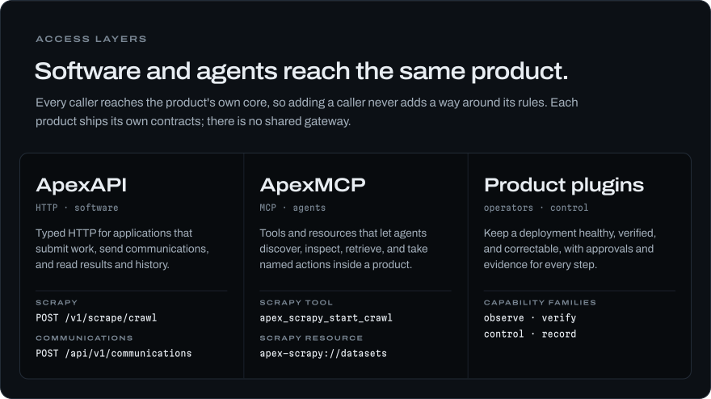</picture></a>

<a href="https://apexaiofficial.com/custom-orders"><picture><source media="(max-width: 640px)" srcset="assets/custom-orders-narrow.svg">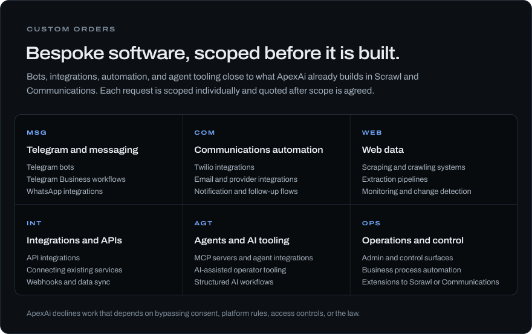</picture></a>

<picture><source media="(max-width: 640px)" srcset="assets/open-source-narrow.svg"></picture>

  <a href="https://github.com/ApexAiOfficial/privacy-chain">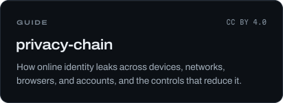</a>
  <a href="https://github.com/ApexAiOfficial/telegram-bot-tutorial">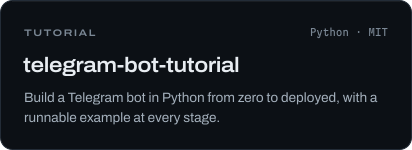</a>
  <a href="https://github.com/ApexAiOfficial/termux-kit">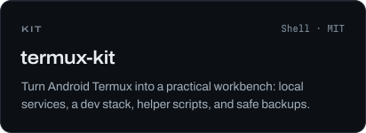</a>
  <a href="https://github.com/ApexAiOfficial/termux-telegram-bot">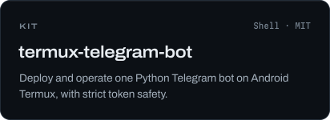</a>
  <a href="https://github.com/ApexAiOfficial/cookie-manager">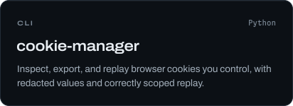</a>
  <a href="https://github.com/ApexAiOfficial?tab=repositories&type=source">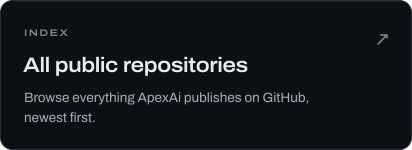</a>

<a href="https://apexaiofficial.com"><picture><source media="(max-width: 640px)" srcset="assets/footer-narrow.svg"></picture></a>

  <a href="https://apexaiofficial.com">apexaiofficial.com</a> ·
  <a href="mailto:support@apexaiofficial.com">support@apexaiofficial.com</a>
   
  On Telegram:
  <a href="https://t.me/ApexAiOfficial">official updates</a> ·
  <a href="https://t.me/ApexAiCentral">community</a> ·
  <a href="https://t.me/ApexAiScraperBot">Scrapy bot</a> ·
  <a href="https://t.me/ApexAiComms_bot">Communications bot</a>

